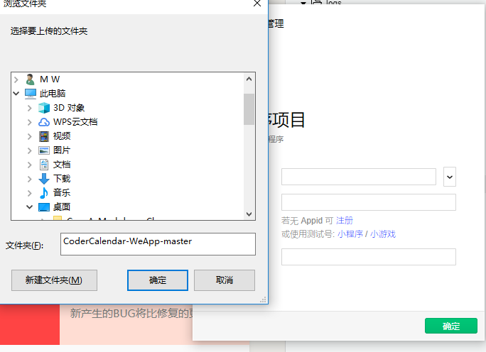
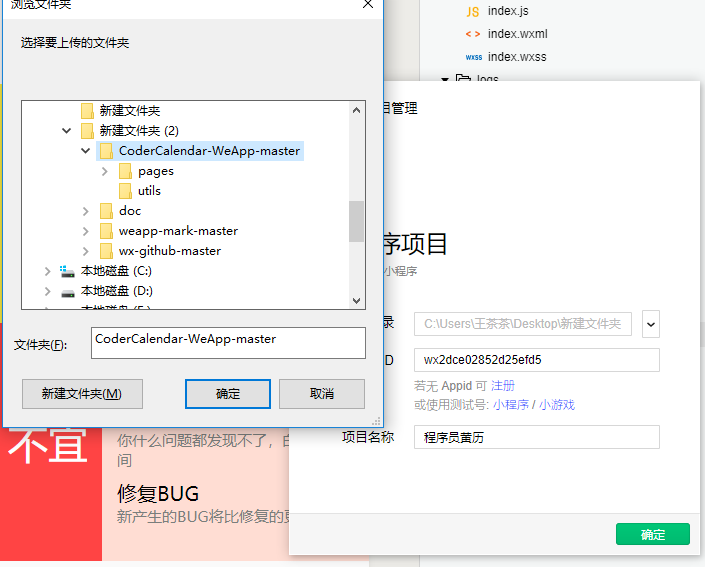
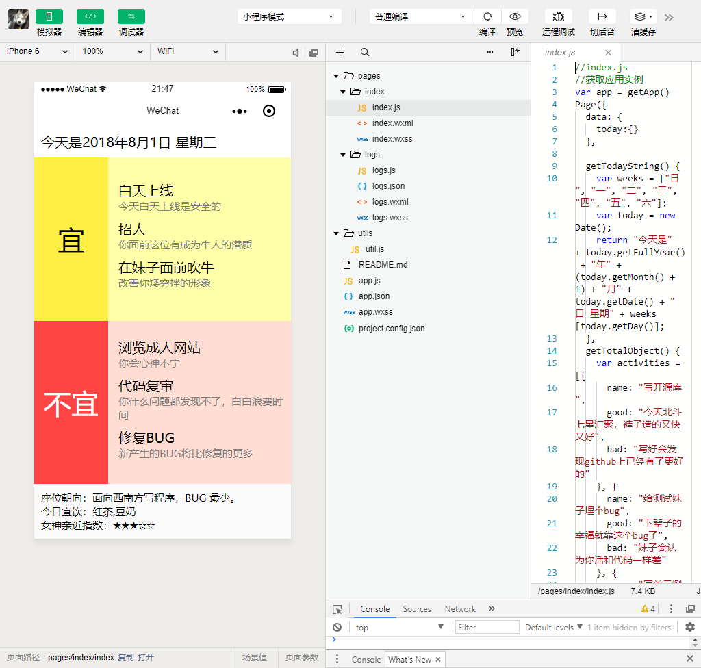

# 微信小程序案例

* CoderCalendar

## 准备工作

* [申请账号](https://developers.weixin.qq.com/miniprogram/dev/quickstart/basic/getting-started.html)
* 登录获得Appid
* 安装微信web开发者工具：[https://developers.weixin.qq.com/miniprogram/dev/devtools/download.html?t=2018724](https://developers.weixin.qq.com/miniprogram/dev/devtools/download.html?t=2018724)

## 新建项目

1.新建文件夹

2.填写APPID或点击小程序/小游戏测试号

##程序员黄历 

此程序简单易懂，少网络连接少接口。适合上手，谁都能跑
下载地址：[程序员黄历] （https://github.com/xujinyang/CoderCalendar-WeApp）

**导入项目**

选择好目录appid以及项目名

## 运行小程序

## 结束

总结：不出什么意外这个小程序是可以直接运行的没有任何难度初学可以借此程序了解小程序基本的界面代码
